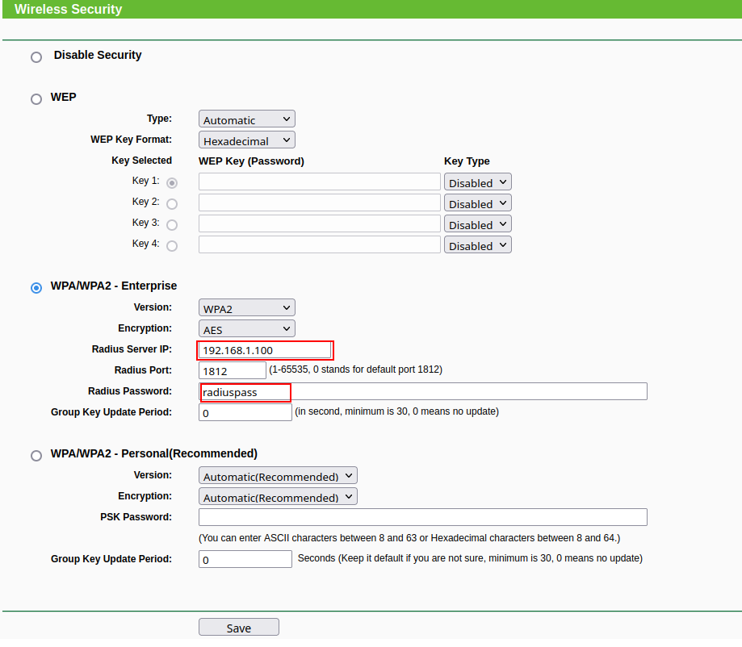

# FreeRadius over alpine:edge with EAP-TLS (freeradius-alpine)

## Steps to set up Router
Select the WPA2-Enterprise in your Router Wireless Security. Take into account the Radius Server IP (where the RADIUS server will be running) and the Radius Password. E.g., the Radius Password in this case is **radiuspass**, and the Server IP is **192.168.1.100**:


Make sure that the Radius Server is set with the correct IP.

## Steps to build container

### Build EasyRSA container (for certificate generation)
```
docker build easyrsa -t easyrsa
```

### Build freeradius-alpine docker container
```
docker build -t freeradius-alpine .
```
### Generate certificates (example client name: johndoe)
You can specify as many clients as you want (re-run this command each time, replacing word "johndoe" with any client names you like).
```
docker run -it -v pki:/easyrsa/pki easyrsa build-client-full johndoe
```

After generating certificates and private keys, you need to copy them manually from a "pki" docker volume to your client machine (total of 3 files):
* ca.crt (Central Authority Certificate)
* johndoe.crt (Your own certificate file)
* johndoe.key (Your own key file)
The files inside PKI docker volume can be located by navigating to /easyrsa/pki path.

E.g.:
```
CID=$(docker run -d -v pki:/easyrsa/ freeradius-alpine:latest)
```
```
docker cp $CID:/easyrsa ./certsdir
```

Inside certsdir you will find the certificates generated before.

### Running freshly-built docker container (in visible mode)

* **CLIENT_ADDRESS** is based on the AP Address
* **PRIVATE_KEY_PASSWORD** is based on provided key when certificates were generated.

* **CLIENT_SECRET** in this case would be **radiuspass**
```
sudo docker run -it -p 1812:1812/udp --restart=always -v pki:/etc/raddb/certs -e CLIENT_ADDRESS=192.168.1.1 -e CLIENT_SECRET=radiuspass -e PRIVATE_KEY_PASSWORD=password freeradius-alpine:latest
```

Replace "-it" flag with "-d" to daemonize the process to background.
Replace CLIENT_ADDRESS with wifi-hotspot address, as long as CLIENT_SECRET and PRIVATE_KEY_PASSWORD with according values.

### Client configuration
Now you can configure your AP with WPA2 Enterprise, AES, the server IP and client secret.
Use two certificates along with user private key to authenticate against freeradius tls.
Here's how you can do it for example:


*NOTE:* The password is not necessarily the same as **PRIVATE_KEY_PASSWORD**.