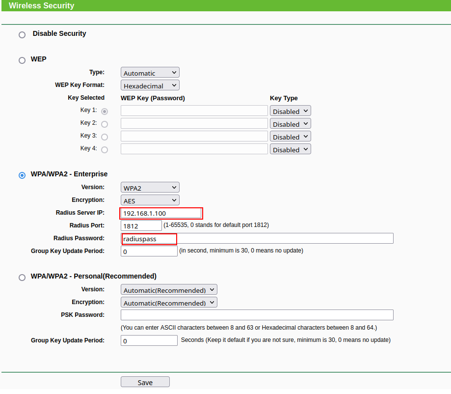
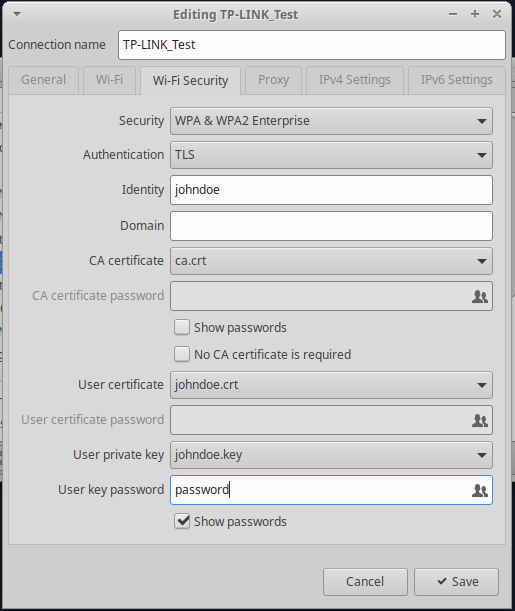

# FreeRadius over alpine:edge with EAP-TLS

## Steps to configure the AP
Select the WPA2-Enterprise in your AP Wireless Security. Take into account the Radius Server IP (where the RADIUS server will be running) and the Radius Password. E.g., the Radius Password in this case is **radiuspass**, and the Server IP is **192.168.1.100**:

Make sure that the Radius Server is set with the correct IP.

## Current options
There are two main structures:
* **freeradius-alpine-easyrsa:** based on EasyRSA to create the certificates.
* **freeradius-alpine-raw:** certificates loaded by hand.

## Client configuration
Now you can configure your AP with WPA2 Enterprise, AES, the server IP and client secret.
Use two certificates along with user private key to authenticate against freeradius tls.
Here's how you can do it for example:

*NOTE:* The password is not necessarily the same as **PRIVATE_KEY_PASSWORD**. Also, **CA certificate is not necessary!!!!**